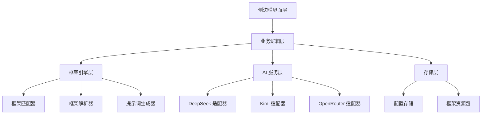
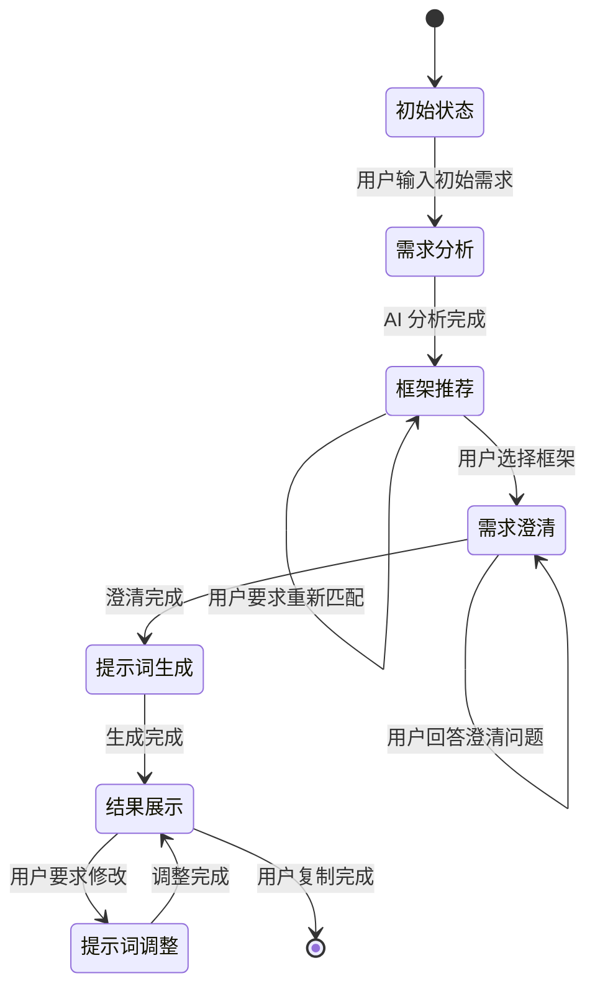
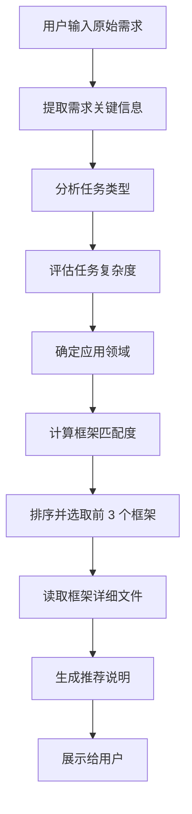
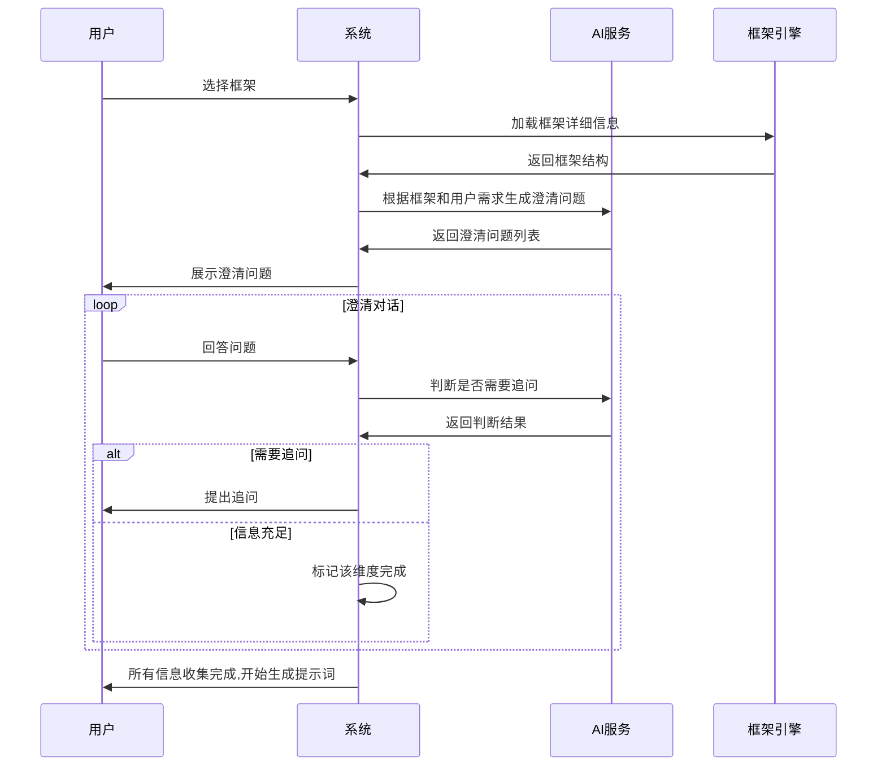
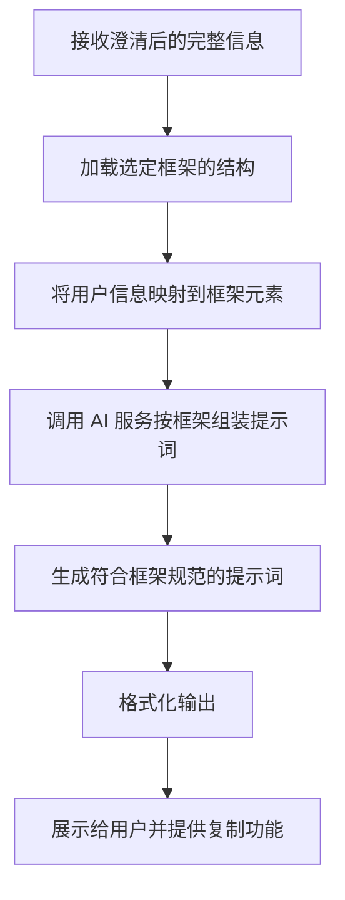
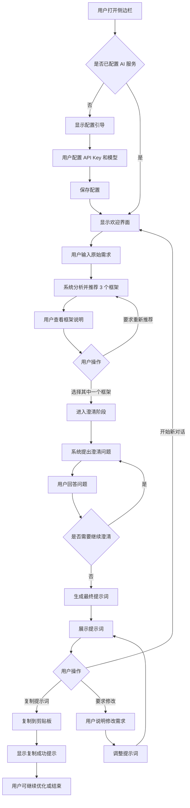

# Chrome 提示词优化器插件设计文档

## 项目概述

基于 prompt-optimizer skill 的 Chrome 浏览器插件,帮助用户通过 57 个成熟的提示词框架自动生成优化的 AI 提示词。插件支持多 AI 服务配置(DeepSeek、Kimi、OpenRouter),通过智能匹配框架并与用户交互澄清需求,最终生成高质量的提示词供用户使用。

## 核心价值

- **智能框架匹配**:根据用户输入自动分析并推荐最适合的 3 个提示词框架
- **交互式澄清**:通过对话式交互帮助用户明确需求细节
- **多服务支持**:灵活配置不同 AI 服务的 API 密钥和模型
- **即用即得**:生成的提示词可直接复制使用,无需额外处理

## 系统架构

### 整体架构层次



### 核心组件职责

| 组件 | 职责 |
|------|------|
| 侧边栏界面层 | 用户交互入口,展示对话流程、框架推荐、配置管理 |
| 业务逻辑层 | 协调各层交互,管理对话状态和工作流程 |
| 框架引擎层 | 框架匹配、解析和提示词生成的核心逻辑 |
| AI 服务层 | 与外部 AI 服务通信,处理 API 调用 |
| 存储层 | 管理用户配置和框架资源文件 |

## 功能模块设计

### 1. 侧边栏面板(Side Panel)

#### 1.1 面板结构

面板采用单页应用形式,分为以下区域:

- **顶部工具栏**:包含设置按钮、新对话按钮
- **主对话区**:显示对话历史和系统提示
- **输入区**:用户输入文本框和发送按钮
- **框架推荐卡片区**:动态显示推荐的框架(仅在匹配阶段显示)
- **生成结果区**:展示最终生成的提示词和复制按钮

#### 1.2 交互状态流转



### 2. 配置管理模块

#### 2.1 配置项数据模型

| 配置项 | 字段名 | 说明 | 验证规则 |
|--------|--------|------|----------|
| DeepSeek API Key | deepseekApiKey | DeepSeek 服务密钥 | 非空字符串 |
| DeepSeek 模型 | deepseekModel | 使用的模型名称 | 非空字符串 |
| Kimi API Key | kimiApiKey | Kimi 服务密钥 | 非空字符串 |
| Kimi 模型 | kimiModel | 使用的模型名称 | 非空字符串 |
| OpenRouter API Key | openrouterApiKey | OpenRouter 服务密钥 | 非空字符串 |
| OpenRouter 模型 | openrouterModel | 使用的模型名称 | 非空字符串 |
| 当前激活服务 | activeService | 当前使用的 AI 服务 | deepseek/kimi/openrouter |

#### 2.2 配置界面

配置界面以模态对话框形式展示,包含:

- **服务选择**:单选按钮选择当前使用的服务
- **服务配置卡片**:每个服务一个折叠卡片,包含 API Key 和模型输入框
- **测试连接按钮**:验证配置是否有效
- **保存按钮**:保存配置到 Chrome Storage

#### 2.3 配置存储策略

- 使用 Chrome Storage Sync API 存储配置
- API Key 使用浏览器原生加密存储
- 配置变更时触发验证流程
- 提供配置导入导出功能(可选)

### 3. 框架匹配引擎

#### 3.1 匹配流程



#### 3.2 匹配算法策略

框架匹配采用多维度评分机制:

**评分维度**:

| 维度 | 权重 | 评分依据 |
|------|------|----------|
| 应用场景匹配度 | 40% | 用户需求与框架应用场景的语义相似度 |
| 复杂度适配性 | 30% | 任务复杂度与框架元素数量的匹配 |
| 领域适用性 | 20% | 用户领域与框架推荐领域的匹配 |
| 框架流行度 | 10% | 框架在对应场景的成功案例数量 |

**复杂度评估规则**:

- 简单任务(≤3 要素):用户需求简短,目标单一,上下文明确
- 中等任务(4-5 要素):需求包含多个维度,有一定上下文要求
- 复杂任务(6+ 要素):需求多层次,涉及多个约束条件和背景信息

**匹配计算流程**:

1. 使用 AI 服务分析用户输入,提取关键词和意图
2. 读取 Frameworks_Summary.md 获取所有框架的应用场景
3. 对每个框架计算各维度得分
4. 加权求和得到总分
5. 按总分降序排列,取前 3 个框架

#### 3.3 框架资源管理

所有框架资源打包到插件中:

- **Frameworks_Summary.md**:框架摘要文件,用于快速匹配
- **frameworks/ 目录**:57 个框架的完整 markdown 文件
- **框架索引表**:预处理的框架元数据,加速查询

框架文件加载策略:

- 插件安装时将所有 markdown 文件打包到扩展资源中
- 匹配阶段仅读取 Frameworks_Summary.md
- 用户选择框架后才加载对应的详细 markdown 文件
- 使用 fetch API 从扩展资源路径读取文件

### 4. 需求澄清引擎

#### 4.1 澄清问题生成策略

根据 SKILL.md 中的澄清要点,系统自动生成问题:

| 澄清维度 | 问题示例 | 触发条件 |
|----------|----------|----------|
| 目标明确性 | "您希望通过这个提示词达成什么具体目标?" | 用户输入缺少明确目标 |
| 目标受众 | "生成的内容主要面向哪类人群?" | 框架需要受众信息 |
| 上下文完整性 | "能否提供更多背景信息?" | 上下文不足 |
| 格式要求 | "对输出格式有特定要求吗?(如长度、结构)" | 框架需要格式约束 |
| 约束条件 | "是否有需要遵守的限制或规范?" | 框架需要边界条件 |

#### 4.2 澄清对话流程



#### 4.3 澄清信息存储结构

| 信息类型 | 存储字段 | 用途 |
|----------|----------|------|
| 原始需求 | originalInput | 用户最初的输入 |
| 选定框架 | selectedFramework | 用户选择的框架名称 |
| 目标说明 | goal | 澄清后的明确目标 |
| 受众信息 | audience | 目标受众描述 |
| 上下文信息 | context | 补充的背景信息 |
| 格式要求 | formatRequirements | 输出格式约束 |
| 约束条件 | constraints | 限制和规范 |
| 补充信息 | additionalInfo | 其他相关信息 |

### 5. 提示词生成引擎

#### 5.1 生成流程



#### 5.2 框架元素映射规则

以 RACEF 框架为例:

| 框架元素 | 映射来源 | 示例 |
|----------|----------|------|
| Rephrase(重述) | 原始需求 + AI 重新表述 | "分析可穿戴技术的最新趋势" |
| Append(附加) | 补充信息 + 上下文 | "包括关键增长因素和消费者偏好" |
| Contextualize(情境化) | 上下文信息 + 约束条件 | "聚焦于北美市场,时间范围为过去五年" |
| Examples(示例) | AI 根据领域生成合适示例要求 | "提供该领域三个成功产品的示例" |
| Follow-Up(跟进) | 目标 + 预期结果 | "建议进入该市场的可操作见解" |

#### 5.3 提示词输出格式

生成的提示词按照以下结构展示:

- **框架名称**:标注使用的框架
- **框架说明**:简要说明该框架的特点
- **完整提示词**:按框架结构组织的提示词内容
- **使用建议**:如何使用该提示词的提示
- **操作按钮**:复制按钮、重新生成按钮

### 6. AI 服务集成层

#### 6.1 服务适配器设计

采用统一接口设计,屏蔽不同 AI 服务的差异:

**统一接口定义**:

| 方法 | 参数 | 返回值 | 说明 |
|------|------|--------|------|
| chat | messages: 对话历史数组 | response: AI 响应文本 | 发送对话请求 |
| validateConfig | apiKey, model | isValid: 布尔值 | 验证配置有效性 |
| estimateTokens | text: 文本 | tokenCount: 整数 | 估算 token 数量 |

**各服务适配器实现**:

| 服务 | API 端点 | 特殊处理 |
|------|----------|----------|
| DeepSeek | https://api.deepseek.com/chat/completions | 标准 OpenAI 格式 |
| Kimi | https://api.moonshot.cn/v1/chat/completions | 标准 OpenAI 格式 |
| OpenRouter | https://openrouter.ai/api/v1/chat/completions | 需要额外的 HTTP-Referer 头 |

#### 6.2 请求格式规范

所有服务使用统一的请求消息格式:

| 字段 | 类型 | 说明 |
|------|------|------|
| role | 字符串 | system / user / assistant |
| content | 字符串 | 消息内容 |
| name | 字符串(可选) | 消息发送者名称 |

#### 6.3 错误处理策略

| 错误类型 | 处理方式 |
|----------|----------|
| API Key 无效 | 提示用户检查配置,引导到设置页面 |
| 网络超时 | 重试 3 次,失败后提示网络问题 |
| 速率限制 | 显示等待提示,延迟后重试 |
| 模型不存在 | 提示用户修改模型名称 |
| 余额不足 | 提示充值或更换服务 |
| 响应格式错误 | 记录错误日志,提示系统异常 |

#### 6.4 系统提示词设计

为不同阶段设计专用的系统提示词:

**框架匹配阶段**:
- 角色:提示词工程专家
- 任务:分析用户需求并推荐最适合的 3 个框架
- 输出格式:结构化的框架推荐列表,包含匹配理由

**需求澄清阶段**:
- 角色:友好的需求分析师
- 任务:根据选定框架提出澄清问题
- 输出格式:简洁的问题列表,一次不超过 3 个问题

**提示词生成阶段**:
- 角色:提示词优化专家
- 任务:严格按照框架结构生成优化的提示词
- 输出格式:完整的结构化提示词

### 7. 对话状态管理

#### 7.1 对话会话模型

| 状态字段 | 类型 | 说明 |
|----------|------|------|
| sessionId | 字符串 | 会话唯一标识 |
| currentStage | 枚举 | 当前阶段:初始/匹配/澄清/生成/完成 |
| userInput | 字符串 | 用户原始输入 |
| recommendedFrameworks | 数组 | 推荐的 3 个框架 |
| selectedFramework | 对象 | 用户选择的框架详情 |
| clarificationData | 对象 | 澄清收集的信息 |
| conversationHistory | 数组 | 对话历史记录 |
| generatedPrompt | 字符串 | 最终生成的提示词 |

#### 7.2 状态转换规则

| 当前状态 | 触发事件 | 目标状态 | 执行动作 |
|----------|----------|----------|----------|
| 初始 | 用户输入需求 | 匹配 | 调用框架匹配引擎 |
| 匹配 | 返回框架推荐 | 匹配(展示) | 显示 3 个推荐框架 |
| 匹配(展示) | 用户选择框架 | 澄清 | 加载框架详情,生成澄清问题 |
| 澄清 | 用户回答问题 | 澄清 | 收集信息,判断是否需要继续澄清 |
| 澄清 | 信息收集完成 | 生成 | 调用提示词生成引擎 |
| 生成 | 生成成功 | 完成 | 展示最终提示词 |
| 完成 | 用户要求修改 | 澄清 | 根据修改意图调整 |
| 任意状态 | 用户点击新对话 | 初始 | 清空会话数据 |

#### 7.3 会话持久化策略

由于需求明确不保存历史记录,会话管理策略:

- 会话数据仅存在于内存中
- 侧边栏关闭时清空所有会话数据
- 提供"新对话"按钮手动清空当前会话
- 刷新页面后回到初始状态

## 用户体验流程

### 完整使用流程



### 关键交互细节

#### 框架推荐展示

展示 3 个推荐框架时,每个框架卡片包含:

- 框架名称(中文和英文)
- 推荐理由(为什么适合这个需求)
- 框架复杂度(简单/中等/复杂)
- 框架核心元素数量
- 选择按钮

用户可以:
- 点击卡片查看更详细的框架说明
- 点击选择按钮确认使用该框架
- 点击"重新推荐"按钮要求系统重新分析

#### 澄清对话交互

澄清阶段的对话设计:

- 系统每次提出 1-3 个问题
- 每个问题下方显示该问题的意图说明
- 用户可以在一个输入框中回答所有问题
- 也可以分多次回答
- 系统智能识别用户回答对应哪个问题
- 显示澄清进度条(如:已完成 3/5 个维度)

#### 提示词展示与操作

生成的提示词展示区域:

- 框架名称和图标
- 提示词内容(支持 markdown 渲染)
- 操作按钮区:
  - 复制按钮:一键复制到剪贴板
  - 重新生成按钮:基于相同信息重新生成
  - 调整按钮:进入调整模式
  - 分享按钮(可选):生成分享链接
- 使用提示:简要说明如何使用该提示词

## 技术实现要点

### Chrome Extension 架构

| 组件 | 文件 | 职责 |
|------|------|------|
| Manifest | manifest.json | 声明插件配置和权限 |
| Side Panel | side_panel.html/js | 侧边栏界面和交互逻辑 |
| Background Script | background.js | 后台服务,管理插件生命周期 |
| Content Script | 无需 | 本插件不需要注入内容脚本 |
| Popup | popup.html(可选) | 可用作快捷入口 |

### 所需权限

| 权限 | 用途 |
|------|------|
| sidePanel | 启用侧边栏功能 |
| storage | 存储用户配置 |
| activeTab | 获取当前标签页信息(可选) |
| host_permissions | 访问 AI 服务 API(需配置各服务域名) |

### 资源文件组织

```
extension/
├── manifest.json
├── side_panel/
│   ├── index.html
│   ├── app.js
│   └── styles.css
├── background/
│   └── service_worker.js
├── lib/
│   ├── framework-engine.js
│   ├── ai-service.js
│   └── storage-manager.js
├── resources/
│   ├── frameworks/
│   │   ├── 01_RACEF_Framework.md
│   │   ├── 02_CRISPE_Framework.md
│   │   └── ...  (共 57 个文件)
│   ├── Frameworks_Summary.md
│   └── SKILL.md
└── icons/
    ├── icon16.png
    ├── icon48.png
    └── icon128.png
```

### 框架文件预处理

为加速框架匹配,在构建时生成框架索引:

| 索引字段 | 来源 | 用途 |
|----------|------|------|
| frameworkId | 文件序号 | 唯一标识 |
| nameCn | 文件解析 | 中文名称 |
| nameEn | 文件解析 | 英文名称 |
| scenarios | 应用场景列表 | 匹配计算 |
| complexity | 元素数量推算 | 复杂度判断 |
| domain | 领域分类 | 领域匹配 |
| filePath | 文件路径 | 加载详情 |
| components | 框架元素列表 | 生成提示词 |

### 性能优化策略

| 优化点 | 策略 |
|--------|------|
| 框架文件加载 | 仅在需要时加载,已加载的缓存到内存 |
| AI 请求优化 | 合并相似请求,避免重复调用 |
| 界面渲染 | 虚拟滚动处理长对话历史 |
| 资源打包 | 压缩 markdown 文件,减小插件体积 |
| 响应速度 | 显示加载状态,使用流式响应(如果 API 支持) |

### 安全性考虑

| 安全点 | 措施 |
|--------|------|
| API Key 存储 | 使用 Chrome Storage 加密存储 |
| 网络请求 | HTTPS 加密传输 |
| 内容安全 | 对用户输入进行转义,防止 XSS |
| 权限最小化 | 仅申请必需的权限 |
| 敏感信息 | 不在日志中记录 API Key |

## 核心流程详细说明

### 框架匹配详细流程

1. **用户输入分析**
   - 提取用户输入的关键词
   - 判断任务类型(营销、决策、教育等)
   - 评估输入复杂度
   - 识别领域特征

2. **候选框架筛选**
   - 读取 Frameworks_Summary.md
   - 根据任务类型初步筛选
   - 根据复杂度过滤不匹配的框架
   - 形成候选框架列表(约 10-15 个)

3. **精确匹配计算**
   - 对每个候选框架计算多维度得分
   - 场景匹配:使用语义相似度算法
   - 复杂度匹配:基于规则判断
   - 领域匹配:关键词对比
   - 流行度:预设权重值

4. **结果排序与选择**
   - 综合得分排序
   - 选取前 3 个框架
   - 生成推荐理由

5. **展示准备**
   - 读取选中框架的详细文件
   - 提取核心信息
   - 格式化展示内容

### 需求澄清详细流程

1. **框架分析**
   - 解析选定框架的元素结构
   - 识别每个元素需要的信息类型
   - 确定必填和可选信息

2. **现有信息评估**
   - 分析用户原始输入
   - 识别已提供的信息
   - 标记缺失的信息维度

3. **问题生成**
   - 针对缺失信息生成问题
   - 根据框架特点调整问题措辞
   - 组织问题优先级(重要性排序)

4. **对话管理**
   - 每轮提出 1-3 个问题
   - 收集用户回答
   - 判断回答是否充分
   - 决定是否需要追问

5. **信息整合**
   - 将用户回答映射到框架元素
   - 验证信息完整性
   - 标记澄清完成状态

### 提示词生成详细流程

1. **信息准备**
   - 汇总所有澄清信息
   - 加载框架结构定义
   - 准备框架示例

2. **元素映射**
   - 将用户信息分配到框架各元素
   - 确保每个元素有对应内容
   - 处理可选元素

3. **AI 辅助生成**
   - 构造生成提示词的系统提示词
   - 传入框架结构和用户信息
   - 调用 AI 服务生成

4. **格式化处理**
   - 按框架结构组织内容
   - 美化排版
   - 添加必要的说明

5. **质量检查**
   - 验证生成的提示词包含所有框架元素
   - 检查内容连贯性
   - 确认符合用户需求

6. **展示与后处理**
   - 渲染最终提示词
   - 提供复制功能
   - 准备调整接口

## 异常处理机制

### 配置异常

| 异常场景 | 处理方式 |
|----------|----------|
| 首次使用未配置 | 显示引导页,说明配置步骤 |
| 配置不完整 | 标记缺失项,禁用相关服务 |
| API Key 格式错误 | 即时验证并提示 |
| 配置保存失败 | 提示错误,保留输入内容 |

### 网络异常

| 异常场景 | 处理方式 |
|----------|----------|
| 请求超时 | 显示超时提示,提供重试按钮 |
| 网络断开 | 检测网络状态,提示检查连接 |
| API 服务不可用 | 建议切换其他服务或稍后重试 |
| 响应解析失败 | 记录原始响应,提示系统错误 |

### 业务异常

| 异常场景 | 处理方式 |
|----------|----------|
| 无法匹配框架 | 提示用户提供更多信息或手动选择 |
| 澄清无法继续 | 提供跳过选项,使用现有信息生成 |
| 生成结果不满意 | 提供重新生成和手动调整选项 |
| 用户输入过长 | 提示简化输入或分段处理 |
| 用户输入过短 | 引导用户补充更多细节 |

### 资源异常

| 异常场景 | 处理方式 |
|----------|----------|
| 框架文件加载失败 | 使用备用数据或降级功能 |
| 框架文件损坏 | 记录错误,跳过该框架 |
| 内存不足 | 清理缓存,限制对话历史长度 |

## 扩展性设计

### 框架扩展机制

预留框架扩展能力:

- 框架文件遵循统一的 markdown 格式规范
- 新增框架只需添加 markdown 文件并更新摘要
- 框架索引自动重建
- 无需修改核心代码

### AI 服务扩展

预留更多 AI 服务接入能力:

- 基于统一适配器接口
- 新增服务只需实现适配器
- 配置管理自动适配
- 支持自定义 API 端点

### 功能扩展点

| 扩展点 | 说明 | 优先级 |
|--------|------|--------|
| 提示词模板库 | 保存常用的提示词模板 | 中 |
| 提示词分享 | 生成分享链接供他人使用 | 低 |
| 批量生成 | 同时生成多个框架的提示词对比 | 低 |
| 提示词评分 | AI 评估生成提示词的质量 | 中 |
| 使用统计 | 记录框架使用频率 | 低 |
| 导出功能 | 导出提示词为 PDF 或图片 | 低 |

## 质量保证

### 框架匹配准确性

- 基于真实场景测试匹配算法
- 收集用户反馈优化权重
- 定期校准评分机制

### 提示词质量

- 使用示例验证生成质量
- 对比人工优化的提示词
- 确保符合框架规范

### 用户体验

- 响应时间控制在 5 秒内
- 界面交互流畅无卡顿
- 错误提示清晰易懂
- 操作步骤简单直观

### 测试策略

| 测试类型 | 覆盖范围 |
|----------|----------|
| 功能测试 | 所有核心流程和边界情况 |
| 兼容性测试 | Chrome 版本 100+ |
| 性能测试 | 加载速度、响应时间、内存占用 |
| 安全测试 | API Key 安全、XSS 防护 |
| 用户测试 | 真实用户使用反馈 |

## 部署与发布

### 构建流程

1. 预处理框架文件生成索引
2. 压缩静态资源
3. 打包扩展为 zip 文件
4. 生成版本号和更新日志

### Chrome Web Store 发布

- 准备宣传图和截图
- 编写详细的插件描述
- 设置隐私政策链接
- 提交审核

### 版本管理

采用语义化版本号:

- 主版本号:重大功能变更或架构调整
- 次版本号:新增功能或框架更新
- 修订号:Bug 修复和性能优化

## 项目里程碑

| 阶段 | 交付物 | 验收标准 |
|------|--------|----------|
| 阶段一:基础框架 | 插件基本结构、配置管理、侧边栏界面 | 可配置 AI 服务,界面正常展示 |
| 阶段二:框架引擎 | 框架匹配、资源加载、推荐展示 | 能准确推荐 3 个框架 |
| 阶段三:澄清对话 | 需求澄清、对话管理、信息收集 | 可完成完整澄清流程 |
| 阶段四:生成优化 | 提示词生成、结果展示、复制功能 | 生成符合框架的高质量提示词 |
| 阶段五:优化完善 | 错误处理、性能优化、用户体验改进 | 所有异常有友好提示,响应迅速 |
| 阶段六:测试发布 | 完整测试、文档编写、商店发布 | 通过所有测试,成功上架 |

## 成功指标

| 指标 | 目标值 | 说明 |
|------|--------|------|
| 框架匹配准确率 | ≥85% | 用户选择推荐的前 3 个框架的比例 |
| 平均澄清轮次 | ≤5 轮 | 完成需求澄清的平均对话次数 |
| 提示词生成时间 | ≤10 秒 | 从澄清完成到展示结果的时间 |
| 用户满意度 | ≥4.0/5.0 | 用户对生成提示词的满意度评分 |
| 完成率 | ≥70% | 用户完成完整流程的比例 |
| 复制使用率 | ≥60% | 生成提示词后用户实际复制使用的比例 |
- **框架推荐卡片区**:动态显示推荐的框架(仅在匹配阶段显示)
- **生成结果区**:展示最终生成的提示词和复制按钮

#### 1.2 交互状态流转


### 2. 配置管理模块

#### 2.1 配置项数据模型

| 配置项 | 字段名 | 说明 | 验证规则 |
|--------|--------|------|----------|
| DeepSeek API Key | deepseekApiKey | DeepSeek 服务密钥 | 非空字符串 |
| DeepSeek 模型 | deepseekModel | 使用的模型名称 | 非空字符串 |
| Kimi API Key | kimiApiKey | Kimi 服务密钥 | 非空字符串 |
| Kimi 模型 | kimiModel | 使用的模型名称 | 非空字符串 |
| OpenRouter API Key | openrouterApiKey | OpenRouter 服务密钥 | 非空字符串 |
| OpenRouter 模型 | openrouterModel | 使用的模型名称 | 非空字符串 |
| 当前激活服务 | activeService | 当前使用的 AI 服务 | deepseek/kimi/openrouter |

#### 2.2 配置界面

配置界面以模态对话框形式展示,包含:

- **服务选择**:单选按钮选择当前使用的服务
- **服务配置卡片**:每个服务一个折叠卡片,包含 API Key 和模型输入框
- **测试连接按钮**:验证配置是否有效
- **保存按钮**:保存配置到 Chrome Storage

#### 2.3 配置存储策略

- 使用 Chrome Storage Sync API 存储配置
- API Key 使用浏览器原生加密存储
- 配置变更时触发验证流程
- 提供配置导入导出功能(可选)

### 3. 框架匹配引擎

#### 3.1 匹配流程


#### 3.2 匹配算法策略

框架匹配采用多维度评分机制:

**评分维度**:

| 维度 | 权重 | 评分依据 |
|------|------|----------|
| 应用场景匹配度 | 40% | 用户需求与框架应用场景的语义相似度 |
| 复杂度适配性 | 30% | 任务复杂度与框架元素数量的匹配 |
| 领域适用性 | 20% | 用户领域与框架推荐领域的匹配 |
| 框架流行度 | 10% | 框架在对应场景的成功案例数量 |

**复杂度评估规则**:

- 简单任务(≤3 要素):用户需求简短,目标单一,上下文明确
- 中等任务(4-5 要素):需求包含多个维度,有一定上下文要求
- 复杂任务(6+ 要素):需求多层次,涉及多个约束条件和背景信息

**匹配计算流程**:

1. 使用 AI 服务分析用户输入,提取关键词和意图
2. 读取 Frameworks_Summary.md 获取所有框架的应用场景
3. 对每个框架计算各维度得分
4. 加权求和得到总分
5. 按总分降序排列,取前 3 个框架

#### 3.3 框架资源管理

所有框架资源打包到插件中:

- **Frameworks_Summary.md**:框架摘要文件,用于快速匹配
- **frameworks/ 目录**:57 个框架的完整 markdown 文件
- **框架索引表**:预处理的框架元数据,加速查询

框架文件加载策略:

- 插件安装时将所有 markdown 文件打包到扩展资源中
- 匹配阶段仅读取 Frameworks_Summary.md
- 用户选择框架后才加载对应的详细 markdown 文件
- 使用 fetch API 从扩展资源路径读取文件

### 4. 需求澄清引擎

#### 4.1 澄清问题生成策略

根据 SKILL.md 中的澄清要点,系统自动生成问题:

| 澄清维度 | 问题示例 | 触发条件 |
|----------|----------|----------|
| 目标明确性 | "您希望通过这个提示词达成什么具体目标?" | 用户输入缺少明确目标 |
| 目标受众 | "生成的内容主要面向哪类人群?" | 框架需要受众信息 |
| 上下文完整性 | "能否提供更多背景信息?" | 上下文不足 |
| 格式要求 | "对输出格式有特定要求吗?(如长度、结构)" | 框架需要格式约束 |
| 约束条件 | "是否有需要遵守的限制或规范?" | 框架需要边界条件 |

#### 4.2 澄清对话流程


#### 4.3 澄清信息存储结构

| 信息类型 | 存储字段 | 用途 |
|----------|----------|------|
| 原始需求 | originalInput | 用户最初的输入 |
| 选定框架 | selectedFramework | 用户选择的框架名称 |
| 目标说明 | goal | 澄清后的明确目标 |
| 受众信息 | audience | 目标受众描述 |
| 上下文信息 | context | 补充的背景信息 |
| 格式要求 | formatRequirements | 输出格式约束 |
| 约束条件 | constraints | 限制和规范 |
| 补充信息 | additionalInfo | 其他相关信息 |

### 5. 提示词生成引擎

#### 5.1 生成流程


#### 5.2 框架元素映射规则

以 RACEF 框架为例:

| 框架元素 | 映射来源 | 示例 |
|----------|----------|------|
| Rephrase(重述) | 原始需求 + AI 重新表述 | "分析可穿戴技术的最新趋势" |
| Append(附加) | 补充信息 + 上下文 | "包括关键增长因素和消费者偏好" |
| Contextualize(情境化) | 上下文信息 + 约束条件 | "聚焦于北美市场,时间范围为过去五年" |
| Examples(示例) | AI 根据领域生成合适示例要求 | "提供该领域三个成功产品的示例" |
| Follow-Up(跟进) | 目标 + 预期结果 | "建议进入该市场的可操作见解" |

#### 5.3 提示词输出格式

生成的提示词按照以下结构展示:

- **框架名称**:标注使用的框架
- **框架说明**:简要说明该框架的特点
- **完整提示词**:按框架结构组织的提示词内容
- **使用建议**:如何使用该提示词的提示
- **操作按钮**:复制按钮、重新生成按钮

### 6. AI 服务集成层

#### 6.1 服务适配器设计

采用统一接口设计,屏蔽不同 AI 服务的差异:

**统一接口定义**:

| 方法 | 参数 | 返回值 | 说明 |
|------|------|--------|------|
| chat | messages: 对话历史数组 | response: AI 响应文本 | 发送对话请求 |
| validateConfig | apiKey, model | isValid: 布尔值 | 验证配置有效性 |
| estimateTokens | text: 文本 | tokenCount: 整数 | 估算 token 数量 |

**各服务适配器实现**:

| 服务 | API 端点 | 特殊处理 |
|------|----------|----------|
| DeepSeek | https://api.deepseek.com/chat/completions | 标准 OpenAI 格式 |
| Kimi | https://api.moonshot.cn/v1/chat/completions | 标准 OpenAI 格式 |
| OpenRouter | https://openrouter.ai/api/v1/chat/completions | 需要额外的 HTTP-Referer 头 |

#### 6.2 请求格式规范

所有服务使用统一的请求消息格式:

| 字段 | 类型 | 说明 |
|------|------|------|
| role | 字符串 | system / user / assistant |
| content | 字符串 | 消息内容 |
| name | 字符串(可选) | 消息发送者名称 |

#### 6.3 错误处理策略

| 错误类型 | 处理方式 |
|----------|----------|
| API Key 无效 | 提示用户检查配置,引导到设置页面 |
| 网络超时 | 重试 3 次,失败后提示网络问题 |
| 速率限制 | 显示等待提示,延迟后重试 |
| 模型不存在 | 提示用户修改模型名称 |
| 余额不足 | 提示充值或更换服务 |
| 响应格式错误 | 记录错误日志,提示系统异常 |

#### 6.4 系统提示词设计

为不同阶段设计专用的系统提示词:

**框架匹配阶段**:
- 角色:提示词工程专家
- 任务:分析用户需求并推荐最适合的 3 个框架
- 输出格式:结构化的框架推荐列表,包含匹配理由

**需求澄清阶段**:
- 角色:友好的需求分析师
- 任务:根据选定框架提出澄清问题
- 输出格式:简洁的问题列表,一次不超过 3 个问题

**提示词生成阶段**:
- 角色:提示词优化专家
- 任务:严格按照框架结构生成优化的提示词
- 输出格式:完整的结构化提示词

### 7. 对话状态管理

#### 7.1 对话会话模型

| 状态字段 | 类型 | 说明 |
|----------|------|------|
| sessionId | 字符串 | 会话唯一标识 |
| currentStage | 枚举 | 当前阶段:初始/匹配/澄清/生成/完成 |
| userInput | 字符串 | 用户原始输入 |
| recommendedFrameworks | 数组 | 推荐的 3 个框架 |
| selectedFramework | 对象 | 用户选择的框架详情 |
| clarificationData | 对象 | 澄清收集的信息 |
| conversationHistory | 数组 | 对话历史记录 |
| generatedPrompt | 字符串 | 最终生成的提示词 |

#### 7.2 状态转换规则

| 当前状态 | 触发事件 | 目标状态 | 执行动作 |
|----------|----------|----------|----------|
| 初始 | 用户输入需求 | 匹配 | 调用框架匹配引擎 |
| 匹配 | 返回框架推荐 | 匹配(展示) | 显示 3 个推荐框架 |
| 匹配(展示) | 用户选择框架 | 澄清 | 加载框架详情,生成澄清问题 |
| 澄清 | 用户回答问题 | 澄清 | 收集信息,判断是否需要继续澄清 |
| 澄清 | 信息收集完成 | 生成 | 调用提示词生成引擎 |
| 生成 | 生成成功 | 完成 | 展示最终提示词 |
| 完成 | 用户要求修改 | 澄清 | 根据修改意图调整 |
| 任意状态 | 用户点击新对话 | 初始 | 清空会话数据 |

#### 7.3 会话持久化策略

由于需求明确不保存历史记录,会话管理策略:

- 会话数据仅存在于内存中
- 侧边栏关闭时清空所有会话数据
- 提供"新对话"按钮手动清空当前会话
- 刷新页面后回到初始状态

## 用户体验流程

### 完整使用流程


### 关键交互细节

#### 框架推荐展示

展示 3 个推荐框架时,每个框架卡片包含:

- 框架名称(中文和英文)
- 推荐理由(为什么适合这个需求)
- 框架复杂度(简单/中等/复杂)
- 框架核心元素数量
- 选择按钮

用户可以:
- 点击卡片查看更详细的框架说明
- 点击选择按钮确认使用该框架
- 点击"重新推荐"按钮要求系统重新分析

#### 澄清对话交互

澄清阶段的对话设计:

- 系统每次提出 1-3 个问题
- 每个问题下方显示该问题的意图说明
- 用户可以在一个输入框中回答所有问题
- 也可以分多次回答
- 系统智能识别用户回答对应哪个问题
- 显示澄清进度条(如:已完成 3/5 个维度)

#### 提示词展示与操作

生成的提示词展示区域:

- 框架名称和图标
- 提示词内容(支持 markdown 渲染)
- 操作按钮区:
  - 复制按钮:一键复制到剪贴板
  - 重新生成按钮:基于相同信息重新生成
  - 调整按钮:进入调整模式
  - 分享按钮(可选):生成分享链接
- 使用提示:简要说明如何使用该提示词

## 技术实现要点

### Chrome Extension 架构

| 组件 | 文件 | 职责 |
|------|------|------|
| Manifest | manifest.json | 声明插件配置和权限 |
| Side Panel | side_panel.html/js | 侧边栏界面和交互逻辑 |
| Background Script | background.js | 后台服务,管理插件生命周期 |
| Content Script | 无需 | 本插件不需要注入内容脚本 |
| Popup | popup.html(可选) | 可用作快捷入口 |

### 所需权限

| 权限 | 用途 |
|------|------|
| sidePanel | 启用侧边栏功能 |
| storage | 存储用户配置 |
| activeTab | 获取当前标签页信息(可选) |
| host_permissions | 访问 AI 服务 API(需配置各服务域名) |

### 资源文件组织

```
extension/
├── manifest.json
├── side_panel/
│   ├── index.html
│   ├── app.js
│   └── styles.css
├── background/
│   └── service_worker.js
├── lib/
│   ├── framework-engine.js
│   ├── ai-service.js
│   └── storage-manager.js
├── resources/
│   ├── frameworks/
│   │   ├── 01_RACEF_Framework.md
│   │   ├── 02_CRISPE_Framework.md
│   │   └── ...  (共 57 个文件)
│   ├── Frameworks_Summary.md
│   └── SKILL.md
└── icons/
    ├── icon16.png
    ├── icon48.png
    └── icon128.png
```

### 框架文件预处理

为加速框架匹配,在构建时生成框架索引:

| 索引字段 | 来源 | 用途 |
|----------|------|------|
| frameworkId | 文件序号 | 唯一标识 |
| nameCn | 文件解析 | 中文名称 |
| nameEn | 文件解析 | 英文名称 |
| scenarios | 应用场景列表 | 匹配计算 |
| complexity | 元素数量推算 | 复杂度判断 |
| domain | 领域分类 | 领域匹配 |
| filePath | 文件路径 | 加载详情 |
| components | 框架元素列表 | 生成提示词 |

### 性能优化策略

| 优化点 | 策略 |
|--------|------|
| 框架文件加载 | 仅在需要时加载,已加载的缓存到内存 |
| AI 请求优化 | 合并相似请求,避免重复调用 |
| 界面渲染 | 虚拟滚动处理长对话历史 |
| 资源打包 | 压缩 markdown 文件,减小插件体积 |
| 响应速度 | 显示加载状态,使用流式响应(如果 API 支持) |

### 安全性考虑

| 安全点 | 措施 |
|--------|------|
| API Key 存储 | 使用 Chrome Storage 加密存储 |
| 网络请求 | HTTPS 加密传输 |
| 内容安全 | 对用户输入进行转义,防止 XSS |
| 权限最小化 | 仅申请必需的权限 |
| 敏感信息 | 不在日志中记录 API Key |

## 核心流程详细说明

### 框架匹配详细流程

1. **用户输入分析**
   - 提取用户输入的关键词
   - 判断任务类型(营销、决策、教育等)
   - 评估输入复杂度
   - 识别领域特征

2. **候选框架筛选**
   - 读取 Frameworks_Summary.md
   - 根据任务类型初步筛选
   - 根据复杂度过滤不匹配的框架
   - 形成候选框架列表(约 10-15 个)

3. **精确匹配计算**
   - 对每个候选框架计算多维度得分
   - 场景匹配:使用语义相似度算法
   - 复杂度匹配:基于规则判断
   - 领域匹配:关键词对比
   - 流行度:预设权重值

4. **结果排序与选择**
   - 综合得分排序
   - 选取前 3 个框架
   - 生成推荐理由

5. **展示准备**
   - 读取选中框架的详细文件
   - 提取核心信息
   - 格式化展示内容

### 需求澄清详细流程

1. **框架分析**
   - 解析选定框架的元素结构
   - 识别每个元素需要的信息类型
   - 确定必填和可选信息

2. **现有信息评估**
   - 分析用户原始输入
   - 识别已提供的信息
   - 标记缺失的信息维度

3. **问题生成**
   - 针对缺失信息生成问题
   - 根据框架特点调整问题措辞
   - 组织问题优先级(重要性排序)

4. **对话管理**
   - 每轮提出 1-3 个问题
   - 收集用户回答
   - 判断回答是否充分
   - 决定是否需要追问

5. **信息整合**
   - 将用户回答映射到框架元素
   - 验证信息完整性
   - 标记澄清完成状态

### 提示词生成详细流程

1. **信息准备**
   - 汇总所有澄清信息
   - 加载框架结构定义
   - 准备框架示例

2. **元素映射**
   - 将用户信息分配到框架各元素
   - 确保每个元素有对应内容
   - 处理可选元素

3. **AI 辅助生成**
   - 构造生成提示词的系统提示词
   - 传入框架结构和用户信息
   - 调用 AI 服务生成

4. **格式化处理**
   - 按框架结构组织内容
   - 美化排版
   - 添加必要的说明

5. **质量检查**
   - 验证生成的提示词包含所有框架元素
   - 检查内容连贯性
   - 确认符合用户需求

6. **展示与后处理**
   - 渲染最终提示词
   - 提供复制功能
   - 准备调整接口

## 异常处理机制

### 配置异常

| 异常场景 | 处理方式 |
|----------|----------|
| 首次使用未配置 | 显示引导页,说明配置步骤 |
| 配置不完整 | 标记缺失项,禁用相关服务 |
| API Key 格式错误 | 即时验证并提示 |
| 配置保存失败 | 提示错误,保留输入内容 |

### 网络异常

| 异常场景 | 处理方式 |
|----------|----------|
| 请求超时 | 显示超时提示,提供重试按钮 |
| 网络断开 | 检测网络状态,提示检查连接 |
| API 服务不可用 | 建议切换其他服务或稍后重试 |
| 响应解析失败 | 记录原始响应,提示系统错误 |

### 业务异常

| 异常场景 | 处理方式 |
|----------|----------|
| 无法匹配框架 | 提示用户提供更多信息或手动选择 |
| 澄清无法继续 | 提供跳过选项,使用现有信息生成 |
| 生成结果不满意 | 提供重新生成和手动调整选项 |
| 用户输入过长 | 提示简化输入或分段处理 |
| 用户输入过短 | 引导用户补充更多细节 |

### 资源异常

| 异常场景 | 处理方式 |
|----------|----------|
| 框架文件加载失败 | 使用备用数据或降级功能 |
| 框架文件损坏 | 记录错误,跳过该框架 |
| 内存不足 | 清理缓存,限制对话历史长度 |

## 扩展性设计

### 框架扩展机制

预留框架扩展能力:

- 框架文件遵循统一的 markdown 格式规范
- 新增框架只需添加 markdown 文件并更新摘要
- 框架索引自动重建
- 无需修改核心代码

### AI 服务扩展

预留更多 AI 服务接入能力:

- 基于统一适配器接口
- 新增服务只需实现适配器
- 配置管理自动适配
- 支持自定义 API 端点

### 功能扩展点

| 扩展点 | 说明 | 优先级 |
|--------|------|--------|
| 提示词模板库 | 保存常用的提示词模板 | 中 |
| 提示词分享 | 生成分享链接供他人使用 | 低 |
| 批量生成 | 同时生成多个框架的提示词对比 | 低 |
| 提示词评分 | AI 评估生成提示词的质量 | 中 |
| 使用统计 | 记录框架使用频率 | 低 |
| 导出功能 | 导出提示词为 PDF 或图片 | 低 |

## 质量保证

### 框架匹配准确性

- 基于真实场景测试匹配算法
- 收集用户反馈优化权重
- 定期校准评分机制

### 提示词质量

- 使用示例验证生成质量
- 对比人工优化的提示词
- 确保符合框架规范

### 用户体验

- 响应时间控制在 5 秒内
- 界面交互流畅无卡顿
- 错误提示清晰易懂
- 操作步骤简单直观

### 测试策略

| 测试类型 | 覆盖范围 |
|----------|----------|
| 功能测试 | 所有核心流程和边界情况 |
| 兼容性测试 | Chrome 版本 100+ |
| 性能测试 | 加载速度、响应时间、内存占用 |
| 安全测试 | API Key 安全、XSS 防护 |
| 用户测试 | 真实用户使用反馈 |

## 部署与发布

### 构建流程

1. 预处理框架文件生成索引
2. 压缩静态资源
3. 打包扩展为 zip 文件
4. 生成版本号和更新日志

### Chrome Web Store 发布

- 准备宣传图和截图
- 编写详细的插件描述
- 设置隐私政策链接
- 提交审核

### 版本管理

采用语义化版本号:

- 主版本号:重大功能变更或架构调整
- 次版本号:新增功能或框架更新
- 修订号:Bug 修复和性能优化

## 项目里程碑

| 阶段 | 交付物 | 验收标准 |
|------|--------|----------|
| 阶段一:基础框架 | 插件基本结构、配置管理、侧边栏界面 | 可配置 AI 服务,界面正常展示 |
| 阶段二:框架引擎 | 框架匹配、资源加载、推荐展示 | 能准确推荐 3 个框架 |
| 阶段三:澄清对话 | 需求澄清、对话管理、信息收集 | 可完成完整澄清流程 |
| 阶段四:生成优化 | 提示词生成、结果展示、复制功能 | 生成符合框架的高质量提示词 |
| 阶段五:优化完善 | 错误处理、性能优化、用户体验改进 | 所有异常有友好提示,响应迅速 |
| 阶段六:测试发布 | 完整测试、文档编写、商店发布 | 通过所有测试,成功上架 |

## 成功指标

| 指标 | 目标值 | 说明 |
|------|--------|------|
| 框架匹配准确率 | ≥85% | 用户选择推荐的前 3 个框架的比例 |
| 平均澄清轮次 | ≤5 轮 | 完成需求澄清的平均对话次数 |
| 提示词生成时间 | ≤10 秒 | 从澄清完成到展示结果的时间 |
| 用户满意度 | ≥4.0/5.0 | 用户对生成提示词的满意度评分 |
| 完成率 | ≥70% | 用户完成完整流程的比例 |
| 复制使用率 | ≥60% | 生成提示词后用户实际复制使用的比例 |
- **框架推荐卡片区**:动态显示推荐的框架(仅在匹配阶段显示)
- **生成结果区**:展示最终生成的提示词和复制按钮

#### 1.2 交互状态流转


### 2. 配置管理模块

#### 2.1 配置项数据模型

| 配置项 | 字段名 | 说明 | 验证规则 |
|--------|--------|------|----------|
| DeepSeek API Key | deepseekApiKey | DeepSeek 服务密钥 | 非空字符串 |
| DeepSeek 模型 | deepseekModel | 使用的模型名称 | 非空字符串 |
| Kimi API Key | kimiApiKey | Kimi 服务密钥 | 非空字符串 |
| Kimi 模型 | kimiModel | 使用的模型名称 | 非空字符串 |
| OpenRouter API Key | openrouterApiKey | OpenRouter 服务密钥 | 非空字符串 |
| OpenRouter 模型 | openrouterModel | 使用的模型名称 | 非空字符串 |
| 当前激活服务 | activeService | 当前使用的 AI 服务 | deepseek/kimi/openrouter |

#### 2.2 配置界面

配置界面以模态对话框形式展示,包含:

- **服务选择**:单选按钮选择当前使用的服务
- **服务配置卡片**:每个服务一个折叠卡片,包含 API Key 和模型输入框
- **测试连接按钮**:验证配置是否有效
- **保存按钮**:保存配置到 Chrome Storage

#### 2.3 配置存储策略

- 使用 Chrome Storage Sync API 存储配置
- API Key 使用浏览器原生加密存储
- 配置变更时触发验证流程
- 提供配置导入导出功能(可选)

### 3. 框架匹配引擎

#### 3.1 匹配流程


#### 3.2 匹配算法策略

框架匹配采用多维度评分机制:

**评分维度**:

| 维度 | 权重 | 评分依据 |
|------|------|----------|
| 应用场景匹配度 | 40% | 用户需求与框架应用场景的语义相似度 |
| 复杂度适配性 | 30% | 任务复杂度与框架元素数量的匹配 |
| 领域适用性 | 20% | 用户领域与框架推荐领域的匹配 |
| 框架流行度 | 10% | 框架在对应场景的成功案例数量 |

**复杂度评估规则**:

- 简单任务(≤3 要素):用户需求简短,目标单一,上下文明确
- 中等任务(4-5 要素):需求包含多个维度,有一定上下文要求
- 复杂任务(6+ 要素):需求多层次,涉及多个约束条件和背景信息

**匹配计算流程**:

1. 使用 AI 服务分析用户输入,提取关键词和意图
2. 读取 Frameworks_Summary.md 获取所有框架的应用场景
3. 对每个框架计算各维度得分
4. 加权求和得到总分
5. 按总分降序排列,取前 3 个框架

#### 3.3 框架资源管理

所有框架资源打包到插件中:

- **Frameworks_Summary.md**:框架摘要文件,用于快速匹配
- **frameworks/ 目录**:57 个框架的完整 markdown 文件
- **框架索引表**:预处理的框架元数据,加速查询

框架文件加载策略:

- 插件安装时将所有 markdown 文件打包到扩展资源中
- 匹配阶段仅读取 Frameworks_Summary.md
- 用户选择框架后才加载对应的详细 markdown 文件
- 使用 fetch API 从扩展资源路径读取文件

### 4. 需求澄清引擎

#### 4.1 澄清问题生成策略

根据 SKILL.md 中的澄清要点,系统自动生成问题:

| 澄清维度 | 问题示例 | 触发条件 |
|----------|----------|----------|
| 目标明确性 | "您希望通过这个提示词达成什么具体目标?" | 用户输入缺少明确目标 |
| 目标受众 | "生成的内容主要面向哪类人群?" | 框架需要受众信息 |
| 上下文完整性 | "能否提供更多背景信息?" | 上下文不足 |
| 格式要求 | "对输出格式有特定要求吗?(如长度、结构)" | 框架需要格式约束 |
| 约束条件 | "是否有需要遵守的限制或规范?" | 框架需要边界条件 |

#### 4.2 澄清对话流程


#### 4.3 澄清信息存储结构

| 信息类型 | 存储字段 | 用途 |
|----------|----------|------|
| 原始需求 | originalInput | 用户最初的输入 |
| 选定框架 | selectedFramework | 用户选择的框架名称 |
| 目标说明 | goal | 澄清后的明确目标 |
| 受众信息 | audience | 目标受众描述 |
| 上下文信息 | context | 补充的背景信息 |
| 格式要求 | formatRequirements | 输出格式约束 |
| 约束条件 | constraints | 限制和规范 |
| 补充信息 | additionalInfo | 其他相关信息 |

### 5. 提示词生成引擎

#### 5.1 生成流程


#### 5.2 框架元素映射规则

以 RACEF 框架为例:

| 框架元素 | 映射来源 | 示例 |
|----------|----------|------|
| Rephrase(重述) | 原始需求 + AI 重新表述 | "分析可穿戴技术的最新趋势" |
| Append(附加) | 补充信息 + 上下文 | "包括关键增长因素和消费者偏好" |
| Contextualize(情境化) | 上下文信息 + 约束条件 | "聚焦于北美市场,时间范围为过去五年" |
| Examples(示例) | AI 根据领域生成合适示例要求 | "提供该领域三个成功产品的示例" |
| Follow-Up(跟进) | 目标 + 预期结果 | "建议进入该市场的可操作见解" |

#### 5.3 提示词输出格式

生成的提示词按照以下结构展示:

- **框架名称**:标注使用的框架
- **框架说明**:简要说明该框架的特点
- **完整提示词**:按框架结构组织的提示词内容
- **使用建议**:如何使用该提示词的提示
- **操作按钮**:复制按钮、重新生成按钮

### 6. AI 服务集成层

#### 6.1 服务适配器设计

采用统一接口设计,屏蔽不同 AI 服务的差异:

**统一接口定义**:

| 方法 | 参数 | 返回值 | 说明 |
|------|------|--------|------|
| chat | messages: 对话历史数组 | response: AI 响应文本 | 发送对话请求 |
| validateConfig | apiKey, model | isValid: 布尔值 | 验证配置有效性 |
| estimateTokens | text: 文本 | tokenCount: 整数 | 估算 token 数量 |

**各服务适配器实现**:

| 服务 | API 端点 | 特殊处理 |
|------|----------|----------|
| DeepSeek | https://api.deepseek.com/chat/completions | 标准 OpenAI 格式 |
| Kimi | https://api.moonshot.cn/v1/chat/completions | 标准 OpenAI 格式 |
| OpenRouter | https://openrouter.ai/api/v1/chat/completions | 需要额外的 HTTP-Referer 头 |

#### 6.2 请求格式规范

所有服务使用统一的请求消息格式:

| 字段 | 类型 | 说明 |
|------|------|------|
| role | 字符串 | system / user / assistant |
| content | 字符串 | 消息内容 |
| name | 字符串(可选) | 消息发送者名称 |

#### 6.3 错误处理策略

| 错误类型 | 处理方式 |
|----------|----------|
| API Key 无效 | 提示用户检查配置,引导到设置页面 |
| 网络超时 | 重试 3 次,失败后提示网络问题 |
| 速率限制 | 显示等待提示,延迟后重试 |
| 模型不存在 | 提示用户修改模型名称 |
| 余额不足 | 提示充值或更换服务 |
| 响应格式错误 | 记录错误日志,提示系统异常 |

#### 6.4 系统提示词设计

为不同阶段设计专用的系统提示词:

**框架匹配阶段**:
- 角色:提示词工程专家
- 任务:分析用户需求并推荐最适合的 3 个框架
- 输出格式:结构化的框架推荐列表,包含匹配理由

**需求澄清阶段**:
- 角色:友好的需求分析师
- 任务:根据选定框架提出澄清问题
- 输出格式:简洁的问题列表,一次不超过 3 个问题

**提示词生成阶段**:
- 角色:提示词优化专家
- 任务:严格按照框架结构生成优化的提示词
- 输出格式:完整的结构化提示词

### 7. 对话状态管理

#### 7.1 对话会话模型

| 状态字段 | 类型 | 说明 |
|----------|------|------|
| sessionId | 字符串 | 会话唯一标识 |
| currentStage | 枚举 | 当前阶段:初始/匹配/澄清/生成/完成 |
| userInput | 字符串 | 用户原始输入 |
| recommendedFrameworks | 数组 | 推荐的 3 个框架 |
| selectedFramework | 对象 | 用户选择的框架详情 |
| clarificationData | 对象 | 澄清收集的信息 |
| conversationHistory | 数组 | 对话历史记录 |
| generatedPrompt | 字符串 | 最终生成的提示词 |

#### 7.2 状态转换规则

| 当前状态 | 触发事件 | 目标状态 | 执行动作 |
|----------|----------|----------|----------|
| 初始 | 用户输入需求 | 匹配 | 调用框架匹配引擎 |
| 匹配 | 返回框架推荐 | 匹配(展示) | 显示 3 个推荐框架 |
| 匹配(展示) | 用户选择框架 | 澄清 | 加载框架详情,生成澄清问题 |
| 澄清 | 用户回答问题 | 澄清 | 收集信息,判断是否需要继续澄清 |
| 澄清 | 信息收集完成 | 生成 | 调用提示词生成引擎 |
| 生成 | 生成成功 | 完成 | 展示最终提示词 |
| 完成 | 用户要求修改 | 澄清 | 根据修改意图调整 |
| 任意状态 | 用户点击新对话 | 初始 | 清空会话数据 |

#### 7.3 会话持久化策略

由于需求明确不保存历史记录,会话管理策略:

- 会话数据仅存在于内存中
- 侧边栏关闭时清空所有会话数据
- 提供"新对话"按钮手动清空当前会话
- 刷新页面后回到初始状态

## 用户体验流程

### 完整使用流程


### 关键交互细节

#### 框架推荐展示

展示 3 个推荐框架时,每个框架卡片包含:

- 框架名称(中文和英文)
- 推荐理由(为什么适合这个需求)
- 框架复杂度(简单/中等/复杂)
- 框架核心元素数量
- 选择按钮

用户可以:
- 点击卡片查看更详细的框架说明
- 点击选择按钮确认使用该框架
- 点击"重新推荐"按钮要求系统重新分析

#### 澄清对话交互

澄清阶段的对话设计:

- 系统每次提出 1-3 个问题
- 每个问题下方显示该问题的意图说明
- 用户可以在一个输入框中回答所有问题
- 也可以分多次回答
- 系统智能识别用户回答对应哪个问题
- 显示澄清进度条(如:已完成 3/5 个维度)

#### 提示词展示与操作

生成的提示词展示区域:

- 框架名称和图标
- 提示词内容(支持 markdown 渲染)
- 操作按钮区:
  - 复制按钮:一键复制到剪贴板
  - 重新生成按钮:基于相同信息重新生成
  - 调整按钮:进入调整模式
  - 分享按钮(可选):生成分享链接
- 使用提示:简要说明如何使用该提示词

## 技术实现要点

### Chrome Extension 架构

| 组件 | 文件 | 职责 |
|------|------|------|
| Manifest | manifest.json | 声明插件配置和权限 |
| Side Panel | side_panel.html/js | 侧边栏界面和交互逻辑 |
| Background Script | background.js | 后台服务,管理插件生命周期 |
| Content Script | 无需 | 本插件不需要注入内容脚本 |
| Popup | popup.html(可选) | 可用作快捷入口 |

### 所需权限

| 权限 | 用途 |
|------|------|
| sidePanel | 启用侧边栏功能 |
| storage | 存储用户配置 |
| activeTab | 获取当前标签页信息(可选) |
| host_permissions | 访问 AI 服务 API(需配置各服务域名) |

### 资源文件组织

```
extension/
├── manifest.json
├── side_panel/
│   ├── index.html
│   ├── app.js
│   └── styles.css
├── background/
│   └── service_worker.js
├── lib/
│   ├── framework-engine.js
│   ├── ai-service.js
│   └── storage-manager.js
├── resources/
│   ├── frameworks/
│   │   ├── 01_RACEF_Framework.md
│   │   ├── 02_CRISPE_Framework.md
│   │   └── ...  (共 57 个文件)
│   ├── Frameworks_Summary.md
│   └── SKILL.md
└── icons/
    ├── icon16.png
    ├── icon48.png
    └── icon128.png
```

### 框架文件预处理

为加速框架匹配,在构建时生成框架索引:

| 索引字段 | 来源 | 用途 |
|----------|------|------|
| frameworkId | 文件序号 | 唯一标识 |
| nameCn | 文件解析 | 中文名称 |
| nameEn | 文件解析 | 英文名称 |
| scenarios | 应用场景列表 | 匹配计算 |
| complexity | 元素数量推算 | 复杂度判断 |
| domain | 领域分类 | 领域匹配 |
| filePath | 文件路径 | 加载详情 |
| components | 框架元素列表 | 生成提示词 |

### 性能优化策略

| 优化点 | 策略 |
|--------|------|
| 框架文件加载 | 仅在需要时加载,已加载的缓存到内存 |
| AI 请求优化 | 合并相似请求,避免重复调用 |
| 界面渲染 | 虚拟滚动处理长对话历史 |
| 资源打包 | 压缩 markdown 文件,减小插件体积 |
| 响应速度 | 显示加载状态,使用流式响应(如果 API 支持) |

### 安全性考虑

| 安全点 | 措施 |
|--------|------|
| API Key 存储 | 使用 Chrome Storage 加密存储 |
| 网络请求 | HTTPS 加密传输 |
| 内容安全 | 对用户输入进行转义,防止 XSS |
| 权限最小化 | 仅申请必需的权限 |
| 敏感信息 | 不在日志中记录 API Key |

## 核心流程详细说明

### 框架匹配详细流程

1. **用户输入分析**
   - 提取用户输入的关键词
   - 判断任务类型(营销、决策、教育等)
   - 评估输入复杂度
   - 识别领域特征

2. **候选框架筛选**
   - 读取 Frameworks_Summary.md
   - 根据任务类型初步筛选
   - 根据复杂度过滤不匹配的框架
   - 形成候选框架列表(约 10-15 个)

3. **精确匹配计算**
   - 对每个候选框架计算多维度得分
   - 场景匹配:使用语义相似度算法
   - 复杂度匹配:基于规则判断
   - 领域匹配:关键词对比
   - 流行度:预设权重值

4. **结果排序与选择**
   - 综合得分排序
   - 选取前 3 个框架
   - 生成推荐理由

5. **展示准备**
   - 读取选中框架的详细文件
   - 提取核心信息
   - 格式化展示内容

### 需求澄清详细流程

1. **框架分析**
   - 解析选定框架的元素结构
   - 识别每个元素需要的信息类型
   - 确定必填和可选信息

2. **现有信息评估**
   - 分析用户原始输入
   - 识别已提供的信息
   - 标记缺失的信息维度

3. **问题生成**
   - 针对缺失信息生成问题
   - 根据框架特点调整问题措辞
   - 组织问题优先级(重要性排序)

4. **对话管理**
   - 每轮提出 1-3 个问题
   - 收集用户回答
   - 判断回答是否充分
   - 决定是否需要追问

5. **信息整合**
   - 将用户回答映射到框架元素
   - 验证信息完整性
   - 标记澄清完成状态

### 提示词生成详细流程

1. **信息准备**
   - 汇总所有澄清信息
   - 加载框架结构定义
   - 准备框架示例

2. **元素映射**
   - 将用户信息分配到框架各元素
   - 确保每个元素有对应内容
   - 处理可选元素

3. **AI 辅助生成**
   - 构造生成提示词的系统提示词
   - 传入框架结构和用户信息
   - 调用 AI 服务生成

4. **格式化处理**
   - 按框架结构组织内容
   - 美化排版
   - 添加必要的说明

5. **质量检查**
   - 验证生成的提示词包含所有框架元素
   - 检查内容连贯性
   - 确认符合用户需求

6. **展示与后处理**
   - 渲染最终提示词
   - 提供复制功能
   - 准备调整接口

## 异常处理机制

### 配置异常

| 异常场景 | 处理方式 |
|----------|----------|
| 首次使用未配置 | 显示引导页,说明配置步骤 |
| 配置不完整 | 标记缺失项,禁用相关服务 |
| API Key 格式错误 | 即时验证并提示 |
| 配置保存失败 | 提示错误,保留输入内容 |

### 网络异常

| 异常场景 | 处理方式 |
|----------|----------|
| 请求超时 | 显示超时提示,提供重试按钮 |
| 网络断开 | 检测网络状态,提示检查连接 |
| API 服务不可用 | 建议切换其他服务或稍后重试 |
| 响应解析失败 | 记录原始响应,提示系统错误 |

### 业务异常

| 异常场景 | 处理方式 |
|----------|----------|
| 无法匹配框架 | 提示用户提供更多信息或手动选择 |
| 澄清无法继续 | 提供跳过选项,使用现有信息生成 |
| 生成结果不满意 | 提供重新生成和手动调整选项 |
| 用户输入过长 | 提示简化输入或分段处理 |
| 用户输入过短 | 引导用户补充更多细节 |

### 资源异常

| 异常场景 | 处理方式 |
|----------|----------|
| 框架文件加载失败 | 使用备用数据或降级功能 |
| 框架文件损坏 | 记录错误,跳过该框架 |
| 内存不足 | 清理缓存,限制对话历史长度 |

## 扩展性设计

### 框架扩展机制

预留框架扩展能力:

- 框架文件遵循统一的 markdown 格式规范
- 新增框架只需添加 markdown 文件并更新摘要
- 框架索引自动重建
- 无需修改核心代码

### AI 服务扩展

预留更多 AI 服务接入能力:

- 基于统一适配器接口
- 新增服务只需实现适配器
- 配置管理自动适配
- 支持自定义 API 端点

### 功能扩展点

| 扩展点 | 说明 | 优先级 |
|--------|------|--------|
| 提示词模板库 | 保存常用的提示词模板 | 中 |
| 提示词分享 | 生成分享链接供他人使用 | 低 |
| 批量生成 | 同时生成多个框架的提示词对比 | 低 |
| 提示词评分 | AI 评估生成提示词的质量 | 中 |
| 使用统计 | 记录框架使用频率 | 低 |
| 导出功能 | 导出提示词为 PDF 或图片 | 低 |

## 质量保证

### 框架匹配准确性

- 基于真实场景测试匹配算法
- 收集用户反馈优化权重
- 定期校准评分机制

### 提示词质量

- 使用示例验证生成质量
- 对比人工优化的提示词
- 确保符合框架规范

### 用户体验

- 响应时间控制在 5 秒内
- 界面交互流畅无卡顿
- 错误提示清晰易懂
- 操作步骤简单直观

### 测试策略

| 测试类型 | 覆盖范围 |
|----------|----------|
| 功能测试 | 所有核心流程和边界情况 |
| 兼容性测试 | Chrome 版本 100+ |
| 性能测试 | 加载速度、响应时间、内存占用 |
| 安全测试 | API Key 安全、XSS 防护 |
| 用户测试 | 真实用户使用反馈 |

## 部署与发布

### 构建流程

1. 预处理框架文件生成索引
2. 压缩静态资源
3. 打包扩展为 zip 文件
4. 生成版本号和更新日志

### Chrome Web Store 发布

- 准备宣传图和截图
- 编写详细的插件描述
- 设置隐私政策链接
- 提交审核

### 版本管理

采用语义化版本号:

- 主版本号:重大功能变更或架构调整
- 次版本号:新增功能或框架更新
- 修订号:Bug 修复和性能优化

## 项目里程碑

| 阶段 | 交付物 | 验收标准 |
|------|--------|----------|
| 阶段一:基础框架 | 插件基本结构、配置管理、侧边栏界面 | 可配置 AI 服务,界面正常展示 |
| 阶段二:框架引擎 | 框架匹配、资源加载、推荐展示 | 能准确推荐 3 个框架 |
| 阶段三:澄清对话 | 需求澄清、对话管理、信息收集 | 可完成完整澄清流程 |
| 阶段四:生成优化 | 提示词生成、结果展示、复制功能 | 生成符合框架的高质量提示词 |
| 阶段五:优化完善 | 错误处理、性能优化、用户体验改进 | 所有异常有友好提示,响应迅速 |
| 阶段六:测试发布 | 完整测试、文档编写、商店发布 | 通过所有测试,成功上架 |

## 成功指标

| 指标 | 目标值 | 说明 |
|------|--------|------|
| 框架匹配准确率 | ≥85% | 用户选择推荐的前 3 个框架的比例 |
| 平均澄清轮次 | ≤5 轮 | 完成需求澄清的平均对话次数 |
| 提示词生成时间 | ≤10 秒 | 从澄清完成到展示结果的时间 |
| 用户满意度 | ≥4.0/5.0 | 用户对生成提示词的满意度评分 |
| 完成率 | ≥70% | 用户完成完整流程的比例 |
| 复制使用率 | ≥60% | 生成提示词后用户实际复制使用的比例 |
